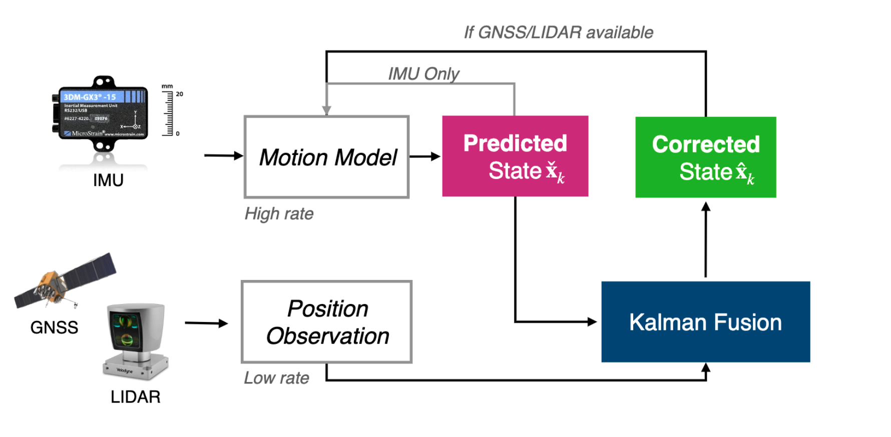

# State Estimation and Localization for Self-Driving Cars

State estimation is a vital part of any self-driving car software stack, which relies on the sensor measurements consists of an IMU, a GNSS receiver, and a LiDAR to provide an accurate state estimation. However, since all of sensors provide measurements of varying reliability and at different rates and reference frame, spacial and temporal multisensor calibration is required.

This project applied the Error-State Extended Kalman Filter (ES-EKF) on state estimation pipeline to enhence the accuracy and reliability of the motion model.


Credit: University of Toronto Institute for Aerospace Studies

## Installation

Install the offcial release of numpy and matplotlib through pip:

```bash
python -m pip install -U pip
python -m pip install -U numpy
python -m pip install -U matplotlib
```

## Compilation & Run


```python
python es_ekf.py
```

## Special Thanks
Special thanks to [State Estimation and Localization for Self-Driving Cars by University of Toronto](https://www.coursera.org/learn/state-estimation-localization-self-driving-cars/home/info) online course. 

## Reference
[Vinohith](https://github.com/Vinohith/Self_Driving_Car_specialization)\
[daniel](https://github.com/daniel-s-ingram/self_driving_cars_specialization)\
[deepanshut041](https://github.com/deepanshut041/self-driving-car-specialization)\
[qiaoxu123](https://github.com/qiaoxu123/Self-Driving-Cars)
